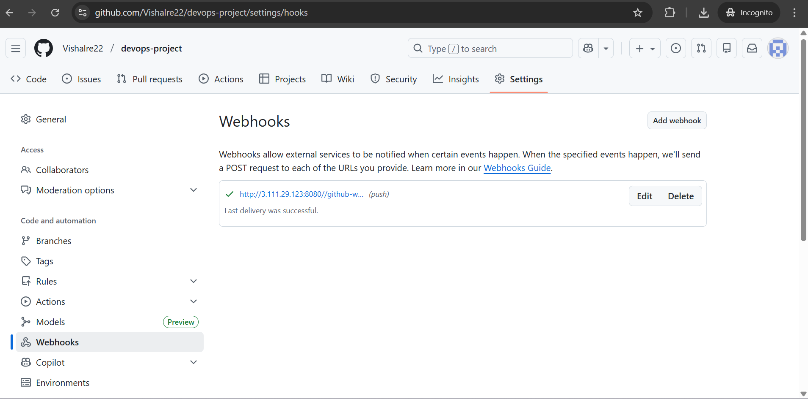
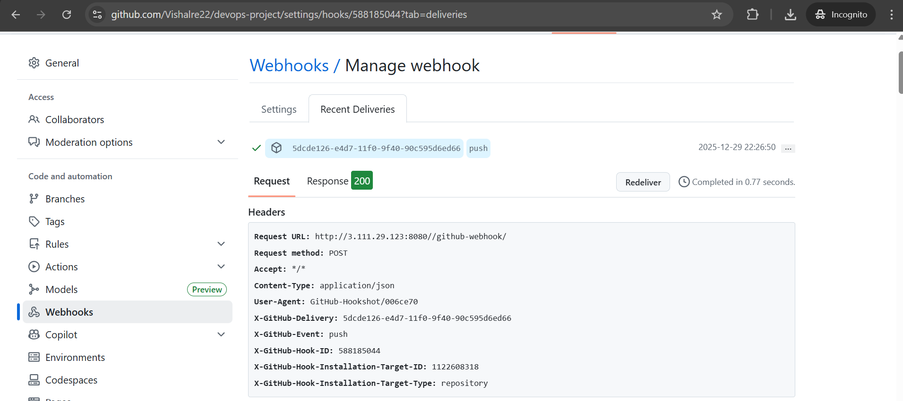
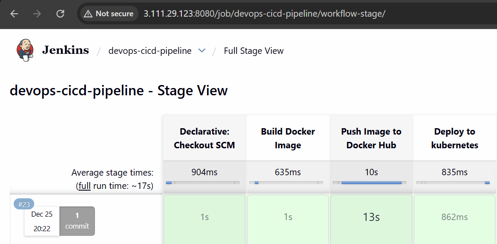
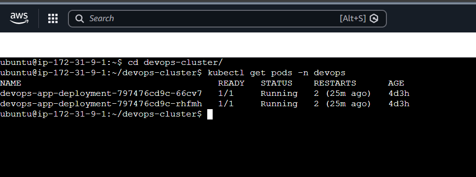
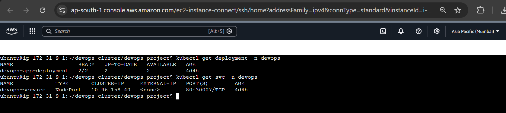
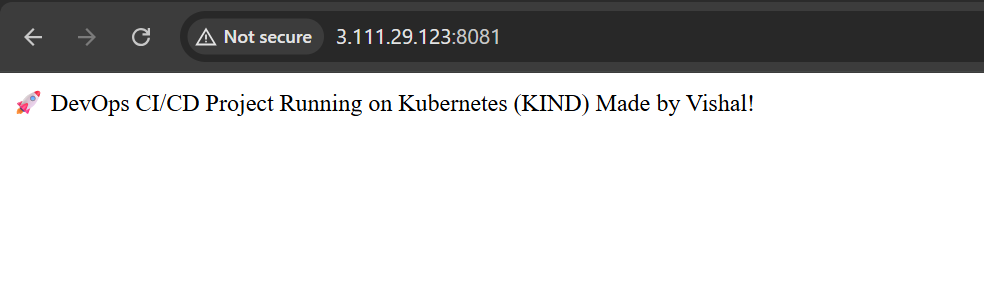
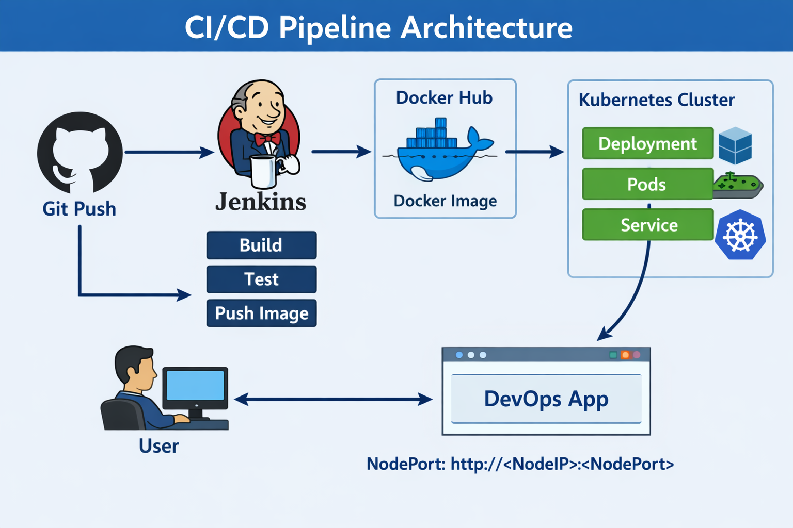

## 📸 Project Screenshots

### 1️⃣ GitHub Webhook Trigger

### 2️⃣ Jenkins Pipeline Console Output

### 3️⃣ Docker Image Pushed to Docker Hub

### 4️⃣ Kubernetes Cluster Nodes

### 5️⃣ Kubernetes Deployment & Service

### 6️⃣ Application Running on Browser

### 7️⃣ CI/CD Architecture Diagram

